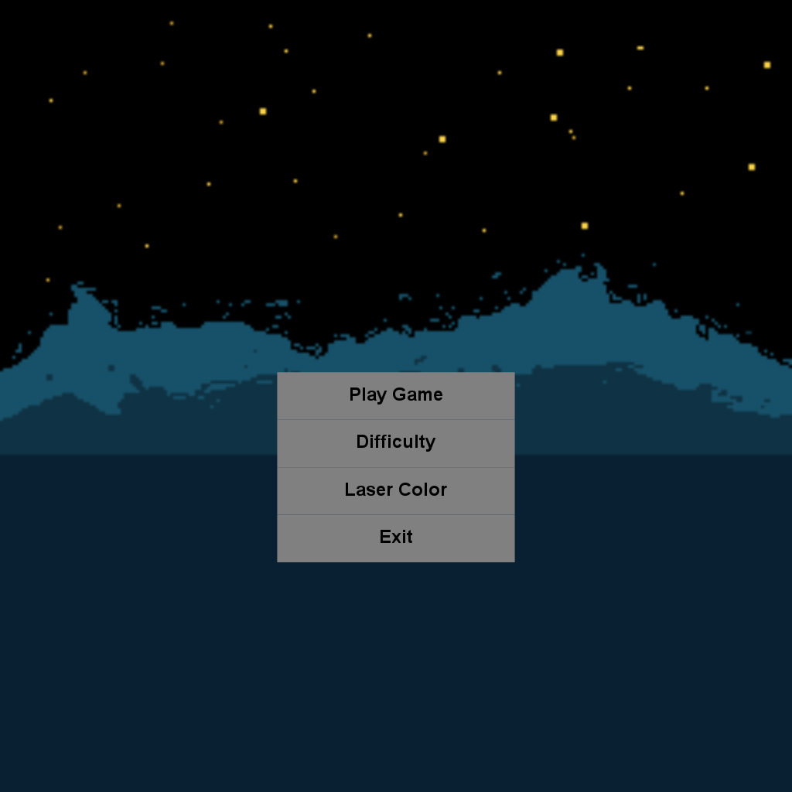

# Space-Invaders
Space Invaders game created using StdDraw as my Intro to Computer Science I final project during Fall 2020
## Description:
The Game rules are pretty straightforward: shoot the bad aliens while evading their lasers. The number of aliens
increase by each round. There is a boss level each 5 rounds, which also gets progressively harder each time
it occurs. Player dies only if their health is dropped to zero. Normal invader dies if player's laser touches it.
Boss invader dies only if their health is dropped to zero. A score is computed after each kill.

### Features:
Main Menu:   Allows user to start game, choose difficulty, alter laser color, and exit game.
Start Menu:  Can only be toggled mid game by ESC button. Allows user to restart game, resume game, change laser color, toggles a godMode, and exit game.

## CONTROLS:
For movement: mouse.
For shooting: Space Bar, any button on mouse.
For opening menu: Escape button.

## Future Improvements
The codebase can be greatly helped by implementing Inheritance and Polymorphism.
# Game:

